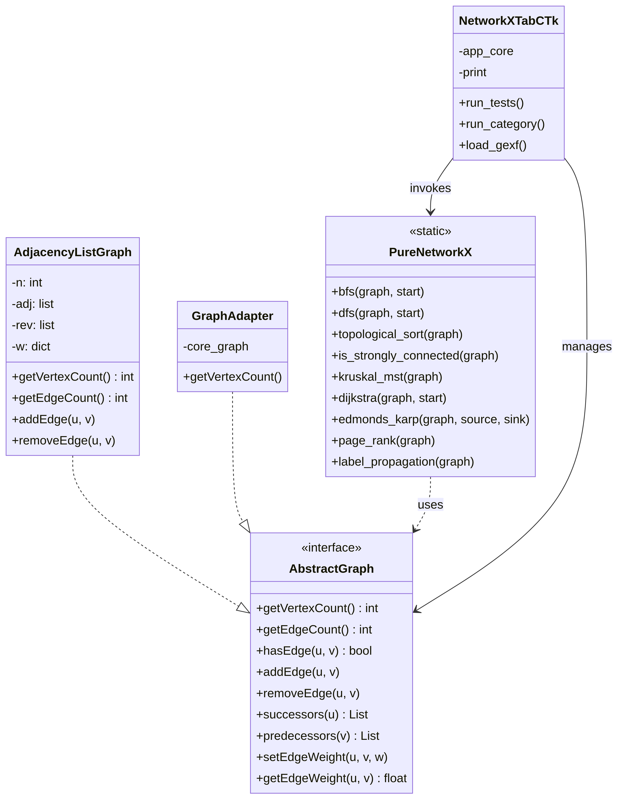

# Pure NetworkX

Implementação nativa em **Python puro** dos principais algoritmos de teoria dos grafos, organizada nas 11 categorias do manual NetworkX e totalmente compatível com a interface `AbstractGraph` do projeto.



---

## Visão Geral

O pacote `networkx_pure` conecta a biblioteca `PureNetworkX` — que não possui dependências externas — à hierarquia `AbstractGraph` / `AdjacencyListGraph` já existente no projeto, sem exigir nenhuma reescrita do núcleo. A integração é feita via `GraphAdapter`, um wrapper que traduz o protocolo `camelCase` esperado pelos algoritmos para o protocolo `snake_case` do projeto.

---

## Estrutura do Pacote

```
networkx_pure/
├── __init__.py            # Exporta a API pública
├── pure_networkx.py       # Classe PureNetworkX com todos os algoritmos
├── adapter.py             # GraphAdapter — bridge camelCase ↔ snake_case
├── gexf_io.py             # Leitura e escrita de arquivos .gexf (Gephi)
├── categories_demo.py     # Demos executáveis das 11 categorias
├── gui/
│   ├── tab_networkx.py    # Aba Tkinter padrão
│   └── tab_networkx_ctk.py# Aba CustomTkinter
└── test_unit/
    └── test_pure_networkx.py
```

---

## Instalação / Integração

O pacote não possui dependências externas além da stdlib do Python. Basta garantir que `networkx_pure` esteja no `PYTHONPATH` do projeto:

```bash
# A partir da raiz do projeto
pip install -e .
```

---

## Uso Rápido

```python
from grafo.graph.adjacency_list_graph import AdjacencyListGraph
from grafo.networkx_pure import GraphAdapter, PureNetworkX, wrap

# 1. Crie ou carregue um grafo do projeto
g = AdjacencyListGraph(5)
g.set_edge_weight(0, 1, 1.0)
g.set_edge_weight(1, 2, 2.0)
g.set_edge_weight(2, 3, 1.0)
g.set_edge_weight(3, 4, 3.0)

# 2. Envolva com o adapter
a = wrap(g)   # equivalente a GraphAdapter(g)

# 3. Use os algoritmos diretamente
print(PureNetworkX.bfs(a, 0))                     # [0, 1, 2, 3, 4]
dist, prev = PureNetworkX.dijkstra(a, 0)
print(dist)                                        # {0: 0, 1: 1.0, 2: 3.0, ...}
print(PureNetworkX.pagerank(a))
```

---

## API — 12 Categorias

### 0. Gerenciamento de Estado

| Método | Descrição |
|--------|-----------|
| `change_subjacente(graph)` | Transforma temporariamente o grafo direcionado em seu subjacente (não-direcionado) |
| `back_from_subjacente(graph, backup)` | Restaura o estado original exatamente |
| `undirected_context(graph)` | Context manager: executa um bloco em modo não-direcionado e restaura ao sair |

### 1. Caminhamentos / Traversals

| Método | Descrição |
|--------|-----------|
| `bfs(graph, start)` | Busca em largura a partir de `start` |
| `dfs(graph, start)` | Busca em profundidade a partir de `start` |
| `topological_sort(graph)` | Ordenação topológica (levanta `GraphError` se houver ciclo) |

### 2. Conectividade

| Método | Descrição |
|--------|-----------|
| `is_weakly_connected(graph)` | Verifica conectividade fraca |
| `is_strongly_connected(graph)` | Verifica conectividade forte |
| `connected_components(graph)` | Lista de componentes fracamente conexas |
| `tarjan_scc(graph)` | Componentes fortemente conexas (algoritmo de Tarjan) |
| `articulation_points(graph)` | Conjunto de vértices de articulação |
| `bridges(graph)` | Lista de pontes |

### 3. Árvores e Árvores Geradoras

| Método | Descrição |
|--------|-----------|
| `is_tree(graph)` | Verifica se o grafo é uma árvore |
| `kruskal_mst(graph)` | Árvore Geradora Mínima — algoritmo de Kruskal |
| `prim_mst(graph, start)` | Árvore Geradora Mínima — algoritmo de Prim |

### 4. Caminhos Mínimos

| Método | Descrição |
|--------|-----------|
| `dijkstra(graph, start)` | Distâncias e predecessores a partir de `start` |
| `shortest_path(graph, start, end)` | Reconstrói o caminho mínimo entre dois vértices |
| `bellman_ford(graph, start)` | Dijkstra com suporte a pesos negativos |
| `floyd_warshall(graph)` | Matriz de distâncias entre todos os pares |
| `a_star(graph, start, goal, heuristic)` | A* com heurística customizável |

### 5. Fluxo em Redes

| Método | Descrição |
|--------|-----------|
| `edmonds_karp(graph, source, sink)` | Fluxo máximo (Edmonds-Karp / BFS) |
| `min_cut(graph, source, sink)` | Corte mínimo: retorna `(valor, S, T)` |

### 6. Isomorfismo e Planaridade

| Método | Descrição |
|--------|-----------|
| `is_isomorphic(g1, g2)` | Verifica isomorfismo via backtracking + heurística de sequência de graus |
| `is_planar(graph)` | Verificação de planaridade |

### 7. Centralidade

| Método | Descrição |
|--------|-----------|
| `degree_centrality(graph)` | Centralidade de grau |
| `closeness_centrality(graph)` | Centralidade de proximidade |
| `betweenness_centrality(graph)` | Centralidade de intermediação |
| `pagerank(graph, alpha, max_iter, tol)` | PageRank (padrão α=0.85) |
| `eigenvector_centrality(graph, ...)` | Centralidade de autovetor |
| `katz_centrality(graph, alpha, beta, ...)` | Centralidade de Katz |

### 8. Clustering & Estrutura

| Método | Descrição |
|--------|-----------|
| `clustering(graph)` | Coeficiente de clustering local por vértice |
| `average_clustering(graph)` | Coeficiente médio global |
| `density(graph)` | Densidade do grafo |
| `transitivity(graph)` | Transitividade global |
| `eccentricity(graph)` | Excentricidade por vértice |
| `diameter(graph)` | Diâmetro do grafo |
| `radius(graph)` | Raio do grafo |

### 9. Comunidades

| Método | Descrição |
|--------|-----------|
| `label_propagation_communities(graph, max_iter, seed)` | Label Propagation |
| `modularity(graph, communities)` | Calcula modularidade de uma partição |
| `girvan_newman(graph, k)` | Detecção hierárquica de comunidades (Girvan-Newman) |

### 10. Geradores de Grafos

| Método | Descrição |
|--------|-----------|
| `empty_graph(n)` | Grafo vazio com `n` vértices |
| `complete_graph(n)` | Grafo completo Kₙ |
| `path_graph(n)` | Grafo caminho Pₙ |
| `cycle_graph(n)` | Grafo ciclo Cₙ |
| `star_graph(n)` | Grafo estrela S(n) |
| `erdos_renyi_graph(n, p, seed)` | Modelo Erdős–Rényi G(n, p) |
| `barabasi_albert_graph(n, m, seed)` | Modelo Barabási–Albert (livre de escala) |
| `watts_strogatz_graph(n, k, p, seed)` | Modelo Watts–Strogatz (mundo pequeno) |

### 11. Álgebra Linear, I/O e Layouts

| Método | Descrição |
|--------|-----------|
| `adjacency_matrix(graph)` | Matriz de adjacência |
| `laplacian_matrix(graph)` | Matriz laplaciana |
| `incidence_matrix(graph)` | Matriz de incidência |
| `write_edgelist(graph, path, delimiter)` | Exporta lista de arestas para arquivo |
| `read_edgelist(path, delimiter, directed)` | Importa lista de arestas de arquivo |
| `circular_layout(graph)` | Posições dos vértices em layout circular |
| `spring_layout(graph, iterations, seed)` | Layout força-dirigida (Fruchterman-Reingold) |

---

## I/O GEXF (Gephi)

```python
from grafo.networkx_pure import read_gexf, write_gexf

# Leitura
graph, is_directed = read_gexf("meu_grafo.gexf")

# Escrita (compatível com Gephi)
write_gexf(graph, "saida.gexf", directed=True)
```

---

## Demos por Categoria

```python
from grafo.networkx_pure import run_category_demo, CATEGORY_NAMES

# Listar nomes das categorias
for i, name in enumerate(CATEGORY_NAMES):
    print(i, name)

# Executar demo da categoria 4 (Caminhos Mínimos)
resultado = run_category_demo(4, meu_grafo)
print(resultado)
# {'dijkstra(0) — distâncias': {0: 0, 1: 1.0, ...},
#  'bellman_ford(0) — distâncias': {...},
#  'floyd_warshall[0]': [...]}
```

---

## GraphAdapter

O `GraphAdapter` envolve qualquer `AbstractGraph` do projeto e expõe o protocolo `camelCase` com cache de vizinhança invalidado automaticamente em mutações:

```python
from grafo.networkx_pure import GraphAdapter, wrap

adapter = wrap(meu_grafo)          # atalho semântico

# Protocolo exposto:
adapter.getVertexCount()
adapter.getEdgeCount()
adapter.hasEdge(u, v)
adapter.addEdge(u, v)
adapter.removeEdge(u, v)
adapter.successors(u)              # lista de sucessores (cacheada)
adapter.predecessors(v)            # lista de predecessores (cacheada)
adapter.getEdgeWeight(u, v)
adapter.setEdgeWeight(u, v, w)
```

---

## Testes

```bash
python -m pytest networkx_pure/test_unit/test_pure_networkx.py -v
```

A suíte cobre: protocolo do `GraphAdapter`, caminhamentos, conectividade, árvores geradoras, caminhos mínimos, fluxo, centralidades, clustering, comunidades, geradores e I/O GEXF — em grafos baseados em `AdjacencyListGraph` e `AdjacencyMatrixGraph`.

---

## Padrões do Código

- **Python puro** — stdlib apenas (`heapq`, `collections`, `math`, `random`)
- **Métodos estáticos** — nenhum estado mutável na classe `PureNetworkX`
- **Defaults imutáveis** — sem armadilhas de argumento padrão mutável
- **Protocolo informal** — `AbstractGraph` é um type alias de `Any`; qualquer objeto que implemente o protocolo camelCase funciona diretamente

---

## Licença

Este módulo faz parte do projeto de TP de Grafos e segue a mesma licença [GNU LICENSE v3](https://github.com/kasshinokun/TP_Grafos_2026_1/blob/main/LICENSE.md).
